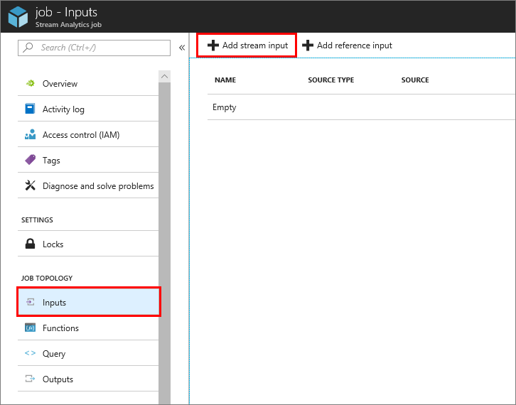
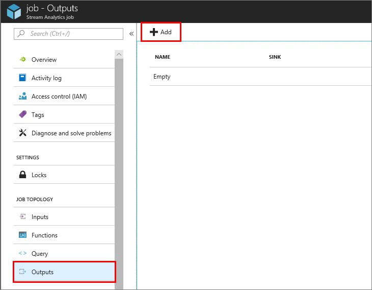
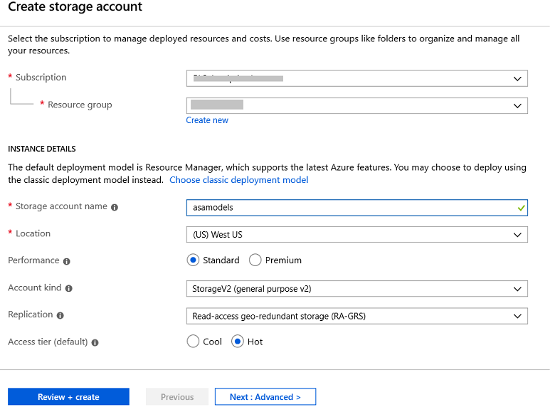
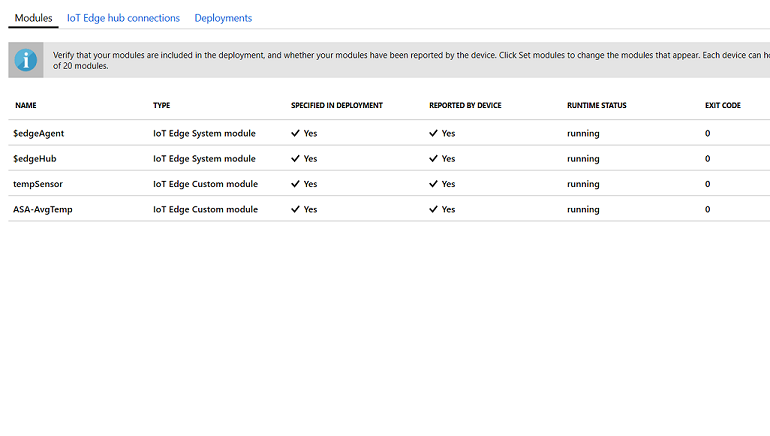

# Windows 10 IoT Core + Azure IoT Edge (60 Min)

Many IoT solutions use analytics services to gain insight about data as it arrives in the cloud from the IoT devices. With Azure IoT Edge, you can take [Azure Stream Analytics](https://docs.microsoft.com/azure/stream-analytics/) logic and move it onto the device itself. By processing telemetry streams at the edge, you can reduce the amount of uploaded data and reduce the time it takes to react to actionable insights.

Azure IoT Edge and Azure Stream Analytics are integrated so that you can create an Azure Stream Analytics job in the Azure portal and then deploy it as an IoT Edge module with no additional code.  

Azure Stream Analytics provides a richly structured query syntax for data analysis both in the cloud and on IoT Edge devices. For more information about Azure Stream Analytics on IoT Edge, see [Azure Stream Analytics documentation](../stream-analytics/stream-analytics-edge.md).

The Stream Analytics module in this lab calculates the average temperature over a rolling 30-second window. When that average reaches 70, the module sends an alert for the device to take action. In this case, that action is to reset the simulated temperature sensor. In a production environment, you might use this functionality to shut off a machine or take preventative measures when the temperature reaches dangerous levels.

In this lab, you learn how to:

* Create an Azure Stream Analytics job to process data on the edge.
* Connect Azure Stream Analytics job with other IoT Edge modules.
* Deploy the Azure Stream Analytics job to an Azure IoT Core device.

Windows IoT Core device is a small device with lesser resources, so we'll be doing most the steps on your lab development machine, then deploy the module to the IoT Core device.

## Prerequisites
- An instance of IoT Hub from the previous HOL
- IoT Core device, for instance an Intel Compute Stick PC. 

## Step 1 : Register the IoT Core device as an Azure IoT Edge device

Command line interface (CLI) is the only interface available in some occasions, so in this lab, we are going to use the Azure Command Line Interface (CLI)to create devices.    

Note: you will need to  enable command line before you can use it on IoT. The admin password is: bootcamp

### 1. Sing in to your Azure account.

If you hadn't signed in to your account. Use the login command which will open a web browser, and sign in to your account with your credential. 

   ```cli
   az login
   ```

### 2. Create a device

Use the following command to create a new device identity in your IoT hub:

   ```cli
   az iot hub device-identity create --device-id [device id] --hub-name [hub name] --edge-enabled
   ```

This command includes three parameters:

 - **device-id**: Provide a descriptive name of your IoT Core device, which is unique to your IoT hub.

 - **hub-name**: Provide the name of your IoT hub.

 - **edge-enabled**: This parameter declares that the device is for use with IoT Edge.

   


Note: If your environment did not have the device-identity extension installed, run the following command

```cli
   az extension add --name azure-cli-iot-ext
```

### 3. View all devices

Use the following command to view all devices in your IoT hub:

   ```cli
   az iot hub device-identity list --hub-name [hub name]

   ```

Any device that is registered as an IoT Edge device will have the property **capabilities.iotEdge** set to **true**.

### 4. Retrieve the connection string

When you're ready to set up your device, you need the connection string that links your physical device with its identity in the IoT hub. Use the following command to return the connection string for a single device:

   ```cli
   az iot hub device-identity show-connection-string --device-id [device id] --hub-name [hub name]
   ```

The value for the `device-id` parameter is case-sensitive. Don't copy the quotation marks around the connection string.

## Step 2: Install IoT Edge on the IoT Core device 

Note: The Intel Compute Stick is the IoT Core device for this lab.

### 1. Open a powershell window as Administrator

### 2. Remote powershell into your IoT Core device 

```
PS C:\repo>  net start WinRM
The requested service has already been started.

More help is available by typing NET HELPMSG 2182.

PS C:\repo> Set-Item WSMan:\localhost\Client\TrustedHosts -Value 192.168.0.81

WinRM Security Configuration.
This command modifies the TrustedHosts list for the WinRM client. The computers in the TrustedHosts list might not be
authenticated. The client might send credential information to these computers. Are you sure that you want to modify
this list?
[Y] Yes  [N] No  [S] Suspend  [?] Help (default is "Y"): Y
PS C:\repo> Enter-PSSession -ComputerName 192.168.0.81 -Credential 192.168.0.81\Administrator
```


### 3. The **Deploy-IoTEdge** command checks that your Windows machine is on a supported version, turns on the containers feature, and then downloads the moby runtime and the IoT Edge runtime. The command defaults to using Windows containers.

```powershell
[192.168.0.81]: PS C:\Data\Users\administrator\Documents> . {Invoke-WebRequest -useb aka.ms/iotedge-win} | Invoke-Expression; Deploy-IoTEdge
```

Note: The stick PC will be restarted as part of the installation. 

### 4. Run the Initialize-IoTEdge command to complete the installation process. 

Need to re-connect to IoT Core, since the prior session was disconnected because of the restart

```powershell

PS C:\repo>  Enter-PSSession -ComputerName 192.168.0.81 -Credential 192.168.0.81\Administrator
[192.168.0.81]: PS C:\Data\Users\administrator\Documents> . {Invoke-WebRequest -useb aks.ms/iotedge} | Invoke-Expression; Initialize-IoTEdge

```
### 5. Provide the device connection string

### 6. Confirm IoT Edge runtime is installed and running on the IoT Core device

You can check the status of the IoT Edge service by: 

```powershell
Get-Service iotedge
```

## Step 3 : Create an Azure Stream Analytics Job

In this section, you create an Azure Stream Analytics job to take data from your IoT hub, query the sent telemetry data from your device, and then forward the results to an Azure Blob storage container. 

### 1. Create a storage account

When you create an Azure Stream Analytics job to run on an IoT Edge device, it needs to be stored in a way that can be called from the device. You can use an existing Azure storage account, or create a new one now. 

1. In the Azure portal, go to **Create a resource** > **Storage** > **Storage account**. 

2. Provide the following values to create your storage account:

   | Field | Value |
   | ----- | ----- |
   | Name | Provide a unique name for your storage account. | 
   | Location | Choose a location close to you. |
   | Subscription | Choose the same subscription as your IoT hub. |
   | Resource group | We recommend that you use the same resource group for all of the test resources that you create for all the labs.|

3. Keep the default values for the other fields and select **Create**. 

### 2. Create a new Azure Stream Analytics job

1. In the Azure portal, go to **Create a resource** > **Internet of Things** > **Stream Analytics Job**.

2. Provide the following values to create your job:

   | Field | Value |
   | ----- | ----- |
   | Job name | Provide a name for your job. For example, **IoTEdgeJob** | 
   | Subscription | Choose the same subscription as your IoT hub. |
   | Resource group | We recommend that you use the same resource group for all of the test resources that you create for all the labs.|
   | Location | Choose a location close to you. | 
   | Hosting environment | Select **Edge**. |
 
3. Select **Create**.

## Step 4. Configure the Azure Stream Analytics job

Once your Stream Analytics job is created in the Azure portal, you can configure it with an input, an output, and a query to run on the data that passes through. 

Using the three elements of input, output, and query, this section creates a job that receives temperature data from the IoT Edge device. It analyzes that data in a rolling 30-second window. If the average temperature in that window goes over 70 degrees, then an alert is sent to the IoT Edge device. You'll specify exactly where the data comes from and goes in the next section when you deploy the job.  

1. Navigate to your Stream Analytics job in the Azure portal. 

1. Under **Job Topology**, select **Inputs** then **Add stream input**.

   

2. Choose **Edge Hub** from the drop-down list.

3. In the **New input** pane, enter **temperature** as the input alias. 

4. Keep the default values for the other fields, and select **Save**.

5. Under **Job Topology**, open **Outputs** then select **Add**.

   

6. Choose **Edge Hub** from the drop-down list.

7. In the **New output** pane, enter **alert** as the output alias. 

8. Keep the default values for the other fields, and select **Save**.

9. Under **Job Topology**, select **Query**.

10. Replace the default text with the following query. The SQL code sends a reset command to the alert output if the average machine temperature in a 30-second window reaches 70 degrees. The reset command has been pre-programmed into the sensor as an action that can be taken. 

    ```sql
    SELECT  
        'reset' AS command 
    INTO 
       alert 
    FROM 
       temperature TIMESTAMP BY timeCreated 
    GROUP BY TumblingWindow(second,30) 
    HAVING Avg(machine.temperature) > 70
    ```

11. Select **Save**.

## Step 5. Configure Storage for ASA Job

To prepare your Stream Analytics job to be deployed on an IoT Edge device, you need to associate the job with a container in a storage account. When you go to deploy your job, the job definition is exported to the storage container. 

1. Under **Configure**, select **Storage account settings**.

1. Select **Add storage account**. 

1. Select your **Storage account** from the drop-down menu.

1. For the **Container** field, select **Create new** and provide a name for the storage container. 

1. Select **Save**. 



## Step 6. Deploy the Azure Stream Analytics job to your IoT Core device

You are now ready to deploy the Azure Stream Analytics job on your IoT Core device. 

In this section, you use the **Set Modules** wizard in the Azure portal to create a *deployment manifest*. A deployment manifest is a JSON file that describes all the modules that will be deployed to a device, the container registries that store the module images, how the modules should be managed, and how the modules can communicate with each other. Your IoT Edge device retrieves its deployment manifest from IoT Hub, then uses the information in it to deploy and configure all of its assigned modules. 

In this lab, you deploy two modules. The first is **Temperature Sensor**, which is a module that simulates a temperature and humidity sensor. The second is your Stream Analytics job. The sensor module provides the stream of data that your job query will analyze. 

1. In the Azure portal, in your IoT hub, go to **IoT Edge**, and then open the details page for your IoT Edge device.

1. Select **Set modules**.  

1. If you previously deployed the tempSensor module on this device, it might autopopulate. If it does not, add the module with the following steps:

   1. Click **Add** and select **IoT Edge Module**.
   1. For the name, type **tempSensor**.
   1. For the image URI, enter **mcr.microsoft.com/azureiotedge-simulated-temperature-sensor:1.0**. 
   1. Leave the other settings unchanged and select **Save**.

1. Add your Azure Stream Analytics Edge job with the following steps:

   1. Click **Add** and select **Azure Stream Analytics Module**.
   1. Select your subscription and the Azure Stream Analytics Edge job that you created. 
   1. Select **Save**.

2. Once your Stream Analytics job is published to the storage container that you created, click on the **Configure** of your ASA module to see how a Stream Analytics module is structured. 

   The image URI points to a standard Azure Stream Analytics image. This is the same image used for every job that gets deployed to an IoT Edge device. 

   The module twin is configured with a desired property called **ASAJobInfo**. The value of that property points to the job definition in your storage container. This property is how the Stream Analytics image is configured with your specific job information. 

3. Close the module page.

4. Make a note of the name of your Stream Analytics module because you'll need it in the next step, then select **Next** to continue.

5. Replace the default value in **Routes** with the following code. Update all three instances of _{moduleName}_ with the name of your Azure Stream Analytics module. 

    ```json
    {
        "routes": {
            "telemetryToCloud": "FROM /messages/modules/tempSensor/* INTO $upstream",
            "alertsToCloud": "FROM /messages/modules/{moduleName}/* INTO $upstream",
            "alertsToReset": "FROM /messages/modules/{moduleName}/* INTO BrokeredEndpoint(\"/modules/tempSensor/inputs/control\")",
            "telemetryToAsa": "FROM /messages/modules/tempSensor/* INTO BrokeredEndpoint(\"/modules/{moduleName}/inputs/temperature\")"
        }
    }
    ```

   The routes that you declare here define the flow of data through the IoT Edge device. The telemetry data from tempSensor are sent to IoT Hub and to the **temperature** input that was configured in the Stream Analytics job. The **alert** output messages are sent to IoT Hub and to the tempSensor module to trigger the reset command. 

6. Select **Next**.

7. In the **Review Deployment** step, select **Submit**.

8. Return to the device details page, and then select **Refresh**.  

    You should see the new Stream Analytics module running, along with the IoT Edge agent module and the IoT Edge hub.

    

## Step 7: View the Data

Now you can go to your IoT Edge device to check out the interaction between the Azure Stream Analytics module and the tempSensor module.

1. Check that all the modules are running in Docker:

   ```cmd/sh
   iotedge list  
   ```
   
   
  
2. View all system logs and metrics data. Use the Stream Analytics module name:

   ```cmd/sh
   iotedge logs -f {moduleName}  
   ```

You should be able to watch the machine's temperature gradually rise until it reaches 70 degrees for 30 seconds. Then the Stream Analytics module triggers a reset, and the machine temperature drops back to 21. 

   

