# Building Intelligent Edge Device

In this Hands on Lab, we will create following scenarios

- Setup Azure IoT Edge Runtime Environment
- Clone, edit, and compile Azure IoT Edge Module
- Deploy the Azure IoT Edge Module
- Control the Azure IoT Ede Module from Cloud

## Prerequisites

## Development Environment (DevEnv)

In this lab, laptops / Surface Pro are pre-configured with following software/tools

- A PC to install and run Windows 10
- Windows 10 IoT  
- Visual Studio Code (VSCode)
- VSCode Extensions
  - IoT Edge Extension
- Git tools  
  Git command line tool as well as Github Desktop are pre-installed in DevEnv
- Docker for Desktop
- VNC Client
- Putty

## Target Device

Hyper-V Virtual Machines are pre-configured with following settings/software/tools

- A Server Machine running Ubuntu VM  
  For this lab, VMs are running with following resources
  - 3 Virtual Processors
  - 8GB RAM
  - 20GB Virtual Hard Drive
- Ubuntu 18.04
- SSH Server
- VNC Server

### Ubuntu VM Credential

```bash  
User Name    : iotbootcamp  
Password     : bootcamp  
VNC Password : bootcamp
```

## Sample Code / Module

### Module Functionality

The sample code provides three major functionalities.  

- Video Stream  
  The modules will read video stream from one of following sources  
  - YouTube Video  
  - RTSP IP Camera  
  - Webcam  
      Not applicable for this Hands on Lab

- AI Inference  
  The module can run Computer Vision AI Inference.  
  This module uses Yolo (You Only Look Once) v3 pre-trained model.

- Web Server  
  The module runs a small web server functionality so you can see the video stream

### Controlling/Managing the Module  

There are two ways you can manage/controlling the module  

- Deployment Manifest  
  You can control the start up time setting(s) of the module via `createOption` parameter in the Deployment Manifest.

- Device Twin  
  You can change settings through Module Twin after the container started running.  
  - VideoSource  
    Source of video stream/capture source

  - ConfidenceLevel  
    Confidence Level threshold.  The module ignores any inference results below this threshold.

  - Verbose  
    Logging verbosity.  For debugging

  > [!TIP]  
  > You can also pre-configure Module Twin `desired` setting in the Deployment Manifest

## Step 1 : Prepare Azure IoT Hub  

Using the Windows 10 DevEnv, create an IoT Hub if you do not have one.  

> [!TIP]  
> Pick your favorite tool to create a new IoT Hub


|Tool     |Link     |
|---------|---------|
|Portal   |[Create an IoT hub using the Azure portal](articles/iot-hub/iot-hub-create-through-portal.md)           |
|AZ CLI   |[Create an IoT hub using the Azure CLI](articles/iot-hub/iot-hub-create-using-cli.md)         |
|VSCode   |[Create an IoT hub using the Azure IoT Tools for Visual Studio Code](articles/iot-hub/iot-hub-create-use-iot-toolkit.md)         |

## Step 2 : Prepare Azure IoT Edge Device

Using the Windows 10 DevEnv, create an IoT Edge Device in the IoT Hub you just created.  

> [!TIP]  
> Pick your favorite tool to create a new IoT Hub.

|Tool     |Link     |
|---------|---------|
|Portal   |[Register a new Azure IoT Edge device from the Azure portal](articles/iot-edge/how-to-register-device-portal.md)         |
|AZ CLI   |[Register a new Azure IoT Edge device with Azure CLI](articles/iot-edge/how-to-register-device-cli.md)         |
|VSCode   |[Register a new Azure IoT Edge device from Visual Studio Code](articles/iot-edge/how-to-register-device-vscode.md)         |

## Step 3 : Install Azure IoT Edge Runtime Environment

Install Azure IoT Edge Runtime to the Hyper-V VM.  

### Step 3.1 : Connect to Ubuntu VM  

In order to install the Azure IoT Edge runtime you need a console access.  
The target Ubuntu installation is pre-configured to accept 2 options:

- Connect with SSH
- Connect with VNC Viewer

> [!TIP]  
> Feel Free to install your favorite SSH client and/or VNC Client software to the DevEnv. 

#### Option 1 : SSH

1. Start Putty on the DevEnv
1. Enter VM Host Name or IP Address

    

1. Dismiss Security Warning Pop-up by clicking `Yes`  

    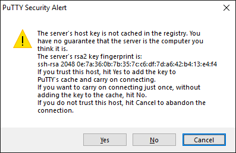

1. Login using following credential  
    ```bash
    **login as** : `iotbootcamp`  
    **password** : `bootcamp`  
    ```
    

#### Option 2 : VNC

1. Start VNC Client on the DevEnv  
  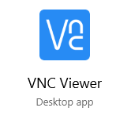

1. Enter VM Host Name or IP Address
  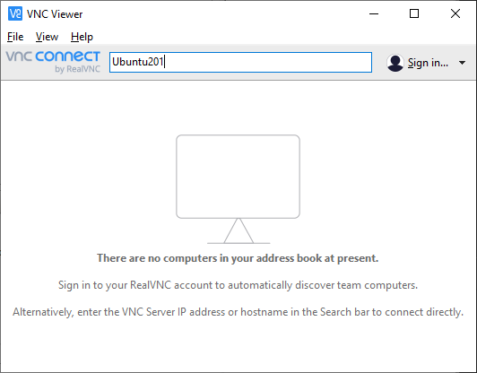

1. Dismiss Security Warning Pop-up  
  You may want to select `Don't warn me about this again on this computer.` checkbox so you do not have to see this warning again.  
  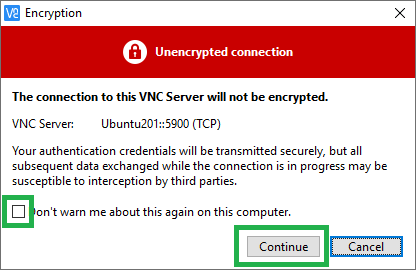

1. Enter Password `bootcamp` 
  You may want to select `Remember password` checkbox so you do not need to enter password again
  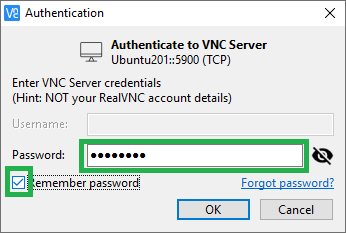

1. You should see lock screen  
  Hit `enter` or click with mouse to display login window
  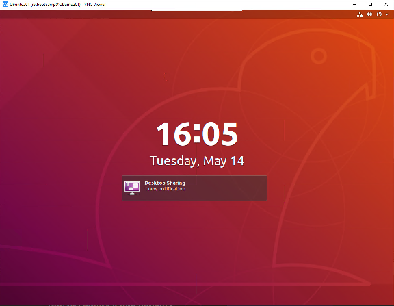

1. Enter Password `bootcamp`  
  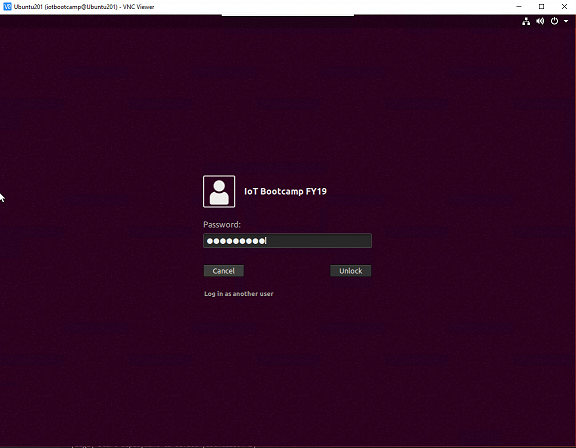

1. You should see Ubuntu Desktop 
  

1. Hit `ctrl + alt + t` to open **Terminal**
  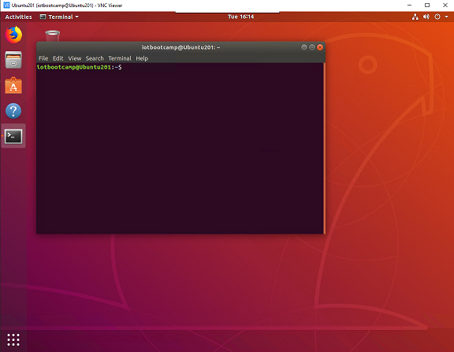

> [!TIP]  
> Once you are connected, VNC Viewer remembers connections.  You can simply double click to connect again.  
> 


### Step 3.2 : Install the Azure IoT Edge runtime

Follow this instruction to install the Azure IoT Edge runtime on the Ubuntu VM

[Install the Azure IoT Edge runtime on Linux (x64)](articles/iot-edge/how-to-install-iot-edge-linux.md)

## Step 4 : Clone Source Code

```bash

git clone https://cdsiotbootcamp.visualstudio.com/bootcamp2019/_git/IntelligentEdgeHOL

```

## Step 5 : Prepare Azure Container Registry

Using the Windows 10 DevEnv, create an instance of Azure Container Registry (ACR).  
ACR is used to :

- The DevEnv uploads (a.k.a. **Push**) container images  
- The Azure IoT Edge runtime downloads (a.k.a. **Pull**) the Azure IoT Edge module(s) during module deployment

> [!TIP]  
> Pick your favorite tool to create a new ACR.

> [!TIP]  
> Make sure to enable Admin Access.  
> Copy following information to access from the DevEnv

|Tool     |Link     |
|---------|---------|
|Portal   |[Create a private container registry using the Azure portal](articles/container-registry/container-registry-get-started-portal.md)         |
|AZ CLI   |[Quickstart: Create a private container registry using the Azure CLI](articles/container-registry/container-registry-get-started-azure-cli.md)       |
|VSCode   | [Create a private container registry using Azure PowerShell](articles/container-registry/container-registry-get-started-powershell.md)        |

## Step 6 : Modify Sample Code

We will configure the sample code with some settings.  

- Open Sample Code Project
- ACR connection credential
- ACR Login
- Azure Login

### Step 6.1 : Open Sample Project

1. Start VSCode
1. From `File` -> `Open Folder`
1. Select `IntelligentEdgeHOL` folder you cloned the sample code  
    Example :  `C:\Repo\IntelligentEdgeHOL`

    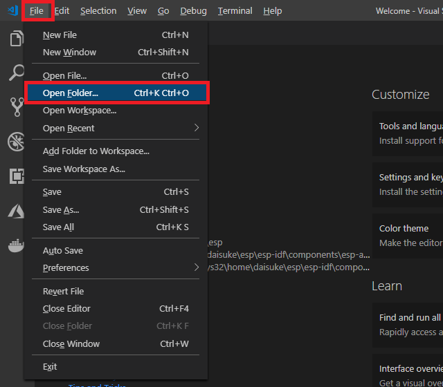

### Step 6.1 : Login to Azure

This step is required so your can access IoT Hub and the Azure IoT Edge Devices in VSCode extension

### Step 6.2 : Login to ACR

This step is required to push the containers to ACR

### Step 6.3 : Edit `.env` file

This step is required for the module deployment.  The deployment manifest contains ACR credential so that the Azure IoT Edge runtime can access ACR to pull container(s)

### Step 6.4 : Specify Video Source

1. Open Web Browser and navigate to http://www.youtube.com
1. Select any video
1. `Right Click` on the video window, and select `Copy video URL`
  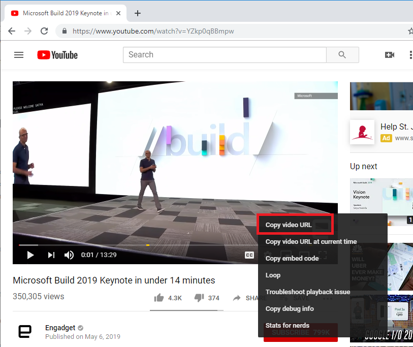

> [!TIP]  
> Choose video that contains objects Yolo pre-trained model can recognize.  
> Please see [the list](#yolo-pre-trained-model) of objects Yolo re-trained model can recognize.

## Step 7 : Build and Push Container Image

The first step is to build and push container

1. Select and right click on `deployment.template.json` from the Explorer pane

1. Click `Build and Push IoT Edge Solution`

    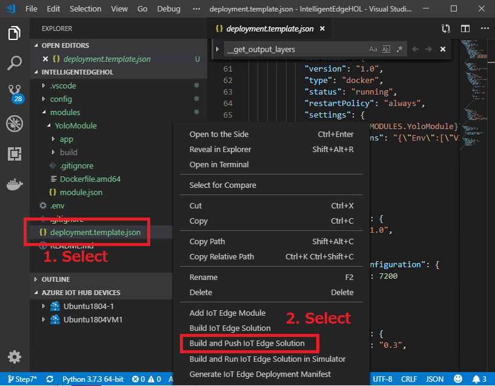

1. Wait until build and push completes
  You can see the progress in the `terminal window`

1. Verify `deployment.amd64.json` is generated in `config` folder

    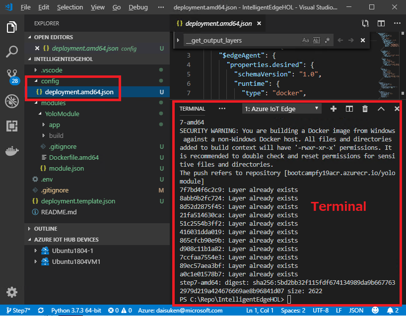

## Step 8 : Deploy Module

This modules only reads video stream and display in the web UI.

### Step 8.1 : Deploy `YoloModule`

1. Select and right click `deployment.amd64.json`

1. Select `Create Deployment for Single Device`

    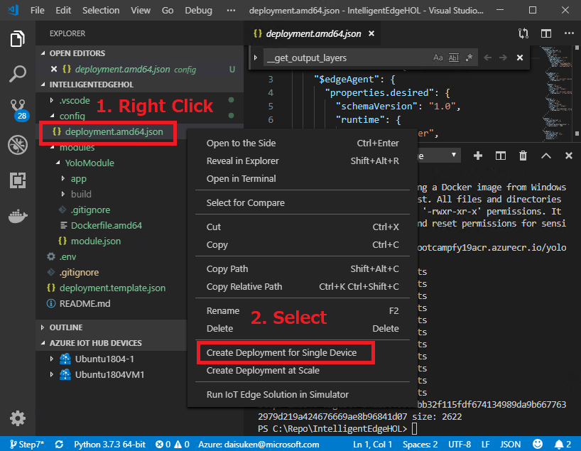

1. `Command Palett` will appear on the top of VSCode window

1. Select the Azure IoT Edge device from the list

    

1. Check the progress by monitoring `edgeAgent` log


    > [!TIP]For exam!  
    > `sudo docker logs -f edgeAgent`  
    > `sudo iotedge logs edgeAgent`

    Example output

    ```bash
    2019-05-15 01:34:09.314 +00:00 [INF] - Executing command: "Command Group: (
      [Create module YoloModule]
      [Start module YoloModule]
    )"
    2019-05-15 01:34:09.314 +00:00 [INF] - Executing command: "Create module YoloModule"
    2019-05-15 01:34:09.886 +00:00 [INF] - Executing command: "Start module YoloModule"
    2019-05-15 01:34:10.356 +00:00 [INF] - Plan execution ended for deployment 10
    2019-05-15 01:34:10.506 +00:00 [INF] - Updated reported properties
    2019-05-15 01:34:15.666 +00:00 [INF] - Updated reported properties
    ```

1. Verify `YoloModule` is deployed and running

    > [!TIP]
    > For exam!  
    > `sudo iotedge list`  
    > `sudo docker ps`  

    ```bash
    iotbootcamp@Ubuntu201:~$ sudo iotedge list
    NAME             STATUS           DESCRIPTION      CONFIG
    edgeAgent        running          Up 11 hours      mcr.microsoft.com/azureiotedge-agent:1.0
    edgeHub          running          Up 11 hours      mcr.microsoft.com/azureiotedge-hub:1.0
    YoloModule       running          Up 36 seconds    bootcampfy19acr.azurecr.io/yolomodule:step7-8-amd64
    
    iotbootcamp@Ubuntu201:~$ sudo docker ps
    CONTAINER ID        IMAGE                                                 COMMAND                   CREATED             STATUS              PORTS                                                                  NAMES
    2357e72e612b        bootcampfy19acr.azurecr.io/yolomodule:step7-8-amd64   "python -u ./main.py"     3 minutes ago       Up 3 minutes        0.0.0.0:80->80/tcp                                                     YoloModule
    ecde10a04f2b        mcr.microsoft.com/azureiotedge-hub:1.0                "/bin/sh -c 'echo \"$…"   12 hours ago        Up 12 hours         0.0.0.0:443->443/tcp, 0.0.0.0:5671->5671/tcp, 0.0.0.0:8883->8883/tcp   edgeHub
    46771922a8b9        mcr.microsoft.com/azureiotedge-agent:1.0              "/bin/sh -c 'echo \"$…"   12 hours ago        Up 12 hours                                                                                edgeAgent
    ```

### Step 8.2 : Verifty Module is functioning

You can confirm the module is working as expected by accessing the web server.

1. Open the Web Server with IP Address or Ubuntu VM Host Name  
  e.g. http://ubuntu201 or http://192.168.0.120

2. You should be able to see video stream

    

3. Check logging from `YoloModule`

    > [!TIP]
    > For exam!  
    > `sudo iotedge logs <Module Name>`  
    > `sudo docker logs <Moudle Name>`  
    >
    > `-f` : option is to *follow* logging  
    > `--tail <number>` : show last N lines  
    >  
    > `sudo docker logs -f YoloModule --tail 100 

```bash
iotbootcamp@Ubuntu201:~$ sudo docker logs -f YoloModule --tail 50
[youtube] unPK61Hz3Rw: Downloading webpage
[youtube] unPK61Hz3Rw: Downloading video info webpage
[download] Destination: /app/video.mp4
[download] 100% of 43.10MiB in 00:0093MiB/s ETA 00:00known ETA
Download Complete
===============================================================
videoCapture::__Run__()
   - Stream          : False
   - useMovieFile    : True
Camera frame size    : 1280x720
       frame size    : 1280x720
Frame rate (FPS)     : 29

device_twin_callback()
   - status  : COMPLETE
   - payload :
{
    "$version": 4,
    "Inference": 1,
    "VerboseMode": 0,
    "ConfidenceLevel": "0.3",
    "VideoSource": "https://www.youtube.com/watch?v=tYcvF8o5GXE"
}
   - ConfidenceLevel : 0.3
   - Verbose         : 0
   - Inference       : 1
   - VideoSource     : https://www.youtube.com/watch?v=tYcvF8o5GXE

===> YouTube Video Source
Start downloading video
WARNING: Assuming --restrict-filenames since file system encoding cannot encode all characters. Set the LC_ALL environment variable to fix this.
[youtube] tYcvF8o5GXE: Downloading webpage
[youtube] tYcvF8o5GXE: Downloading video info webpage
[download] Destination: /app/video.mp4
[download] 100% of 48.16MiB in 00:0080MiB/s ETA 00:00known ETA
Download Complete
```

### Step 8.3 : Change Video Source

Let's change Youtube video through Module Twin.  

1. In VSCode, `Azure IoT Hub Devices` window, expand the Azure IoT Edge Device until you see `YoloModul`

1. Select and right click on `YoloModule`
1. Select `Edit Module Twin`

    


1. In the editor window `azure-iot-module-twin.json` should open

    > [!TIP]
    > For exam!  
    > You can show/hide side bar to get bigger editor window  
    > `ctrl + B` or click button on the top left  
    >   

1. Edit `desired` -> `VideoSource` to set a new different YouTube (c) video

    

1. Right click on anywhere Editor widow, then select `Update Module Twin`

    

1. Depending on the size of video, it may take some time but new video should start playing in your browser

## Step 9 : Add AI Inference Code


```json

```


```
sudo apt-get install -y openssh-server
sudo apt-get install -y curl git
curl https://packages.microsoft.com/config/ubuntu/18.04/prod.list > ./microsoft-prod.list
sudo cp ./microsoft-prod.list /etc/apt/sources.list.d/
curl https://packages.microsoft.com/keys/microsoft.asc | gpg --dearmor > microsoft.gpg
sudo cp ./microsoft.gpg /etc/apt/trusted.gpg.d/

sudo apt-get update
sudo apt-get install moby-engine
sudo apt-get install moby-cli

https://www.youtube.com/watch?v=H2oonkOZkzY


## Yolo Pre-trained Model

Yolo pretrained model recognizes following objects.

```bash
person
bicycle
car
motorbike
aeroplane
bus
train
truck
boat
traffic light
fire hydrant
stop sign
parking meter
bench
bird
cat
dog
horse
sheep
cow
elephant
bear
zebra
giraffe
backpack
umbrella
handbag
tie
suitcase
frisbee
skis
snowboard
sports ball
kite
baseball bat
baseball glove
skateboard
surfboard
tennis racket
bottle
wine glass
cup
fork
knife
spoon
bowl
banana
apple
sandwich
orange
broccoli
carrot
hot dog
pizza
donut
cake
chair
sofa
pottedplant
bed
diningtable
toilet
tvmonitor
laptop
mouse
remote
keyboard
cell phone
microwave
oven
toaster
sink
refrigerator
book
clock
vase
scissors
teddy bear
hair drier
toothbrush
```